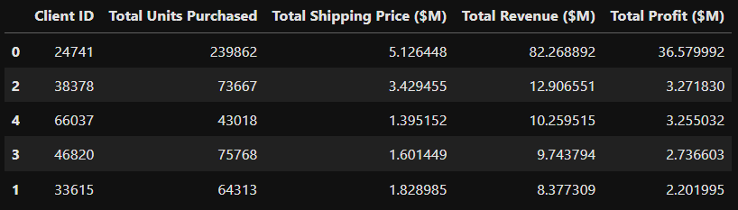

# pandas-challenge-1

## Overview

* This tool is used to analyse and process a sample of wholesale data

* This tool will look at customer orders and return the most frequent costomers alongside their total profit, quantity, and expenses

* The search margins of this tool can be customized in order to extract different information about the clients such as the top clients based on spending or quantity.

## Example of program output
